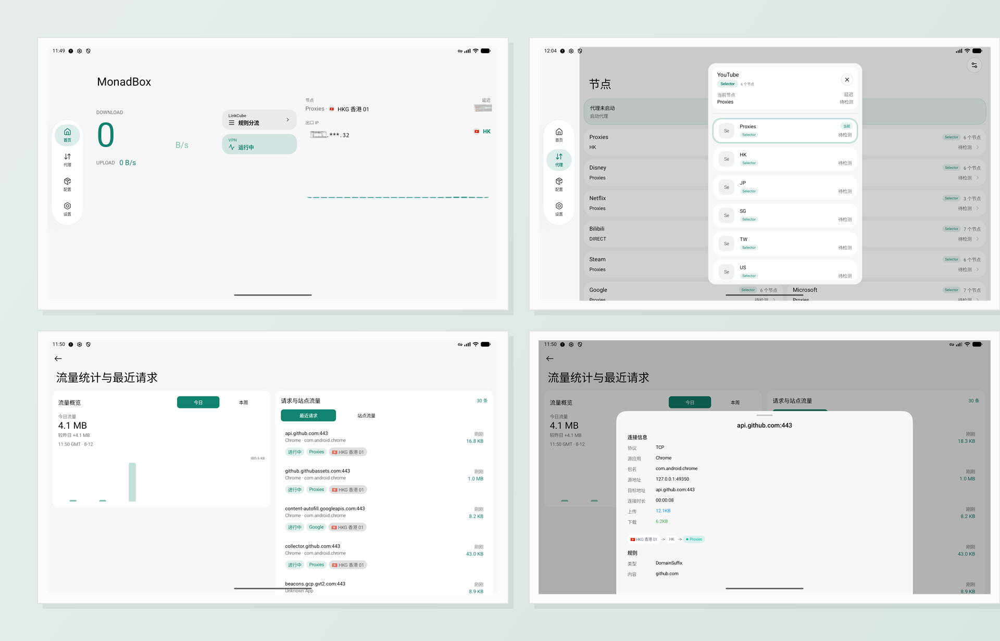

# MonadBox

[English](README.md) | [简体中文](docs/README_ZH_HANS.md)

<p align="center">
   
</p>

<p align="center">
   <sub>Tablet Layout Preview</sub>
</p>

MonadBox is a customized [mihomo](https://github.com/MetaCubeX/mihomo) client for Android, refined from [YumeBox](https://github.com/YumeLira/YumeBox) with adaptive layouts for phones and tablets.

## Overview

- Minimum Android version: `Android 8.0 / API 26`
- Adaptive UI for phones and tablets
- Upstream project: [YumeBox](https://github.com/YumeLira/YumeBox)
- Releases: [MonadBox Releases](https://github.com/MonadBoxLab/MonadBox/releases)
- Issues: [MonadBox Issues](https://github.com/MonadBoxLab/MonadBox/issues)

### Documentation

- Development guide: [docs/DEVELOP.md](docs/DEVELOP.md)
- Licensing policy: [docs/LICENSING.md](docs/LICENSING.md)
- Product specification: [docs/SPEC.md](docs/SPEC.md)
- Privacy notice (EN): [docs/PRIVACY_POLICY.md](docs/PRIVACY_POLICY.md)

## Quick Start

1. Copy local templates:
   - [local.properties.example](local.properties.example)
   - [startup-gate.local.properties.example](startup-gate.local.properties.example)
   - [signing.properties.example](signing.properties.example)
2. Build native artifacts.
3. Run Gradle checks.

Common commands:

```bash
./gradlew spotlessApply
./gradlew test
./gradlew assembleDebug
```

For the complete environment and native build sequence, see [docs/DEVELOP.md](docs/DEVELOP.md).

## Fork Focus

This fork currently emphasizes:

- privacy and safer defaults
- localization and UI polish

## Project Spec Statement

This project follows the 2026 Modern Android Design and Engineering Specification in
[docs/SPEC.md](docs/SPEC.md).

Core rules:

- The app uses layered architecture, unidirectional data flow, UI state, state holders, and repository boundaries.
- The UI uses an adaptive-first, edge-to-edge, information-first Compose design system.
- Product capabilities are exposed in beginner, intermediate, and advanced tiers.
- Core objects are structurally modeled; high-impact changes require confirmation, preview, rollback, or recovery.
- Custom components must provide semantics, accessibility support, and stable test hooks.
- Android platform constraints, including foreground services, window changes, local-network access, and system back behavior, are product constraints.

Merge gates:

1. Stable object model
2. Single source of UI truth
3. Adaptive-layout acceptance
4. Edge-to-edge acceptance
5. Critical-path tests
6. High-risk action protection
7. Component semantics
8. Minimum performance baseline

## License Status

- Repository-owned and fork-derived MonadBox source files are licensed under AGPL-3.0-only.
- Third-party dependencies, synced upstream source, and remote assets keep their own upstream licenses.
- Public GitHub release binaries must pass the policy defined in [docs/LICENSING.md](docs/LICENSING.md).

## Acknowledgements

MonadBox is maintained by MonadBoxLab as an independent fork. Thanks to [YumeBox](https://github.com/YumeLira/YumeBox), [mihomo](https://github.com/MetaCubeX/mihomo), and other open-source projects and contributors.

## Notes

- Authoritative build/toolchain values live in [gradle.properties](gradle.properties).
- UI capability registration is tracked in [config/ui-capability-registry.txt](config/ui-capability-registry.txt).
